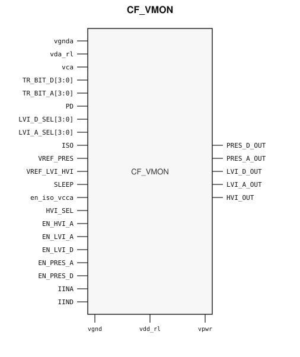

# CF_VMON

> Voltage monitor with brown-out and power-good outputs

Draft for designer review. The public GDS is an abstract; ChipFoundry
substitutes protected full geometry at tapeout.

This package ships an SRAM-style PG wrap `CF_VMON` around analog leaf
`CF_VMON_core`.

## Overview

`CF_VMON` is a SkyWater 130 nm hard macro that supervises analog and digital
supply rails and generates reset or power-good indications. Instantiate
`CF_VMON`.

Precise power-on-reset comparators cover the digital and analog core domains
(`PRES_D_OUT` / `PRES_A_OUT`). Low-voltage indicators cover the same domains
(`LVI_D_OUT` / `LVI_A_OUT`), and `HVI_OUT` flags a high-voltage condition.
Trims `TR_BIT_D` / `TR_BIT_A` and selects `LVI_D_SEL` / `LVI_A_SEL` set the
thresholds. `PD`, `SLEEP`, and `ISO` are the power-down, sleep, and isolation
controls.

Macro size is 322.75 × 391.145 µm (15 µm halo around analog leaf
292.75 × 361.145 µm). Customer PG for chip PDN is `vpwr` / `vgnd` (tied to
the digital core supplies inside the wrap). Analog rails `vca` / `vgnda` and
rings `vda_rl` / `vdd_rl` stay wrap SIGNAL ports so OpenLane can route them.

## Installation

```bash
pip install cf-ipm
ipm install CF_VMON --version 0.2.0 --include-drafts
```

Until the marketplace listing is published, install from a local catalog
override the same way `cf-vmon-test-project` does:

```bash
ipm install CF_VMON --version 0.2.0 --include-drafts --local-file ip/catalog.json
```

Use `hdl/gl/CF_VMON.v` as the customer blackbox, `layout/lef/CF_VMON.lef`
for P&R, and `layout/gds/CF_VMON.gds` / `layout/mag/CF_VMON.mag` for the
public wrap. `CF_VMON_core` is the analog leaf (empty Verilog, pin-only
abstract). ChipFoundry substitutes vault GDS into `CF_VMON_core` at tapeout.
P&R uses the wrap LEF (`vpwr` / `vgnd` for chip PDN).

## Features

- Precise POR outputs `PRES_D_OUT` / `PRES_A_OUT` for digital and analog cores
- Low-voltage indicators `LVI_D_OUT` / `LVI_A_OUT` with 4-bit threshold selects
- High-voltage indicator `HVI_OUT` with `HVI_SEL` / `EN_HVI_A`
- Per-domain trims `TR_BIT_D[3:0]` / `TR_BIT_A[3:0]`
- Power-down `PD`, sleep `SLEEP`, and isolation `ISO` / `en_iso_vcca`
- Customer cell `CF_VMON` 322.75 × 391.145 µm (15 µm halo around analog leaf 292.75 × 361.145 µm)
- Chip PDN is `vpwr` / `vgnd`. Analog `vca` / `vgnda` stay wrap SIGNAL ports.

## Pinout

Customer documentation includes a pinout of the integration cell only.
Internal schematics and architecture block diagrams are not published.



Pin names and directions match the public wrap (`layout/lef/CF_VMON.lef`)
and the blackbox stub (`hdl/gl/CF_VMON.v`).

## Pin Description

Directions and widths are taken from the shipped Verilog in `hdl/gl/CF_VMON.v`.

| Name | Direction | Width | Description |
|---|---|---:|---|
| `PRES_D_OUT` | output | 1 | Precise POR, digital core domain. |
| `PRES_A_OUT` | output | 1 | Precise POR, analog core domain. |
| `LVI_D_OUT` | output | 1 | Low-voltage indicator, digital domain. |
| `LVI_A_OUT` | output | 1 | Low-voltage indicator, analog domain. |
| `HVI_OUT` | output | 1 | High-voltage indicator. |
| `TR_BIT_D` | input | 4 | Digital-domain comparator trim. |
| `TR_BIT_A` | input | 4 | Analog-domain comparator trim. |
| `LVI_D_SEL` | input | 4 | Digital LVI threshold select. |
| `LVI_A_SEL` | input | 4 | Analog LVI threshold select. |
| `PD` | input | 1 | Power-down. |
| `ISO` | input | 1 | Isolation. |
| `SLEEP` | input | 1 | Sleep. |
| `en_iso_vcca` | input | 1 | Analog-domain isolation enable. |
| `HVI_SEL` | input | 1 | High-voltage detector select. |
| `EN_HVI_A` | input | 1 | Enable analog high-voltage detector. |
| `EN_LVI_A` | input | 1 | Enable analog low-voltage indicator. |
| `EN_LVI_D` | input | 1 | Enable digital low-voltage indicator. |
| `EN_PRES_A` | input | 1 | Enable analog precise POR. |
| `EN_PRES_D` | input | 1 | Enable digital precise POR. |
| `VREF_PRES` | input | 1 | Precise-POR analog reference. |
| `VREF_LVI_HVI` | input | 1 | LVI / HVI analog reference. |
| `IINA` | input | 1 | Analog-domain bias current. |
| `IIND` | input | 1 | Digital-domain bias current. |
| `vca` | inout | 1 | Analog core supply (wrap SIGNAL, not chip PDN). |
| `vgnda` | inout | 1 | Analog core ground (wrap SIGNAL, not chip PDN). |
| `vda_rl` | inout | 1 | Analog I/O-domain ring (wrap SIGNAL). |
| `vdd_rl` | inout | 1 | Digital I/O-domain ring (wrap SIGNAL). |
| `vpwr` | input | 1 | Digital core supply (chip PDN). |
| `vgnd` | input | 1 | Digital core ground (chip PDN). |

`CF_VMON_core` also has digital wells / rings `vcd` / `vcd_pb` / `vcd_int` /
`vcd_rl` / `vgndd` / `vgndd_nb` / `vgndd_rl` and analog wells / rings
`vca_pb` / `vca_int` / `vca_rl` / `vgnda_nb` / `vgnda_rl`. The wrap ties
digital wells to `vpwr` / `vgnd` and analog wells to `vca` / `vgnda`. Do not
connect those pins at chip level.

In OpenLane / LibreLane, hook chip PDN with
`PDN_MACRO_CONNECTIONS: "u_cf_vmon vccd1 vssd1 vpwr vgnd"` and connect
`.vpwr(vccd1)`, `.vgnd(vssd1)` under `USE_POWER_PINS`. Route analog rails to
`analog_io`. Do not list the core well taps on the wrapper instance.

## Limitations and Open Issues

- Verilog in `hdl/gl/CF_VMON.v` is a structural wrap around an empty
  `CF_VMON_core` blackbox, not a SPICE-accurate model.
- Liberty is not in this first wrap drop. P&R uses the wrap LEF.
- Companion latchup-variant analog tops stay foundry-only. This package
  ships the wrap around the public analog leaf.
